# Installing and starting Minikube

Install minikube with using the documentation (I used it on Linux so the backend is KVM).

* Set up minikube resources (we need at least 8GB RAM and 4-6 vCPU if we use extra storage provider)

```
$ minikube start -p lab --memory 8g --cpus 4 --disk-size 40g
```

# Install K8S tools on your host machine

* Install kubectl with using the doc: https://kubernetes.io/docs/tasks/tools/install-kubectl-linux/
* Install Helm with using the doc: https://helm.sh/docs/intro/install/

# Install MetalLb

This will install MetalLb. Please change "metallb-values" correspond to your minikube VM network range
To get the range:
```
# stop minikube 
$ minikube stop -p lab
# get the vnets
$ virsh net-list
# Get the definition of minikube vnet
$ virsh net-dumpxml mk-lab | grep range
# Change the dhcp range to have a fix ip range for metallb eg.:
$ virsh net-update mk-lab delete ip-dhcp-range "<range start='192.168.39.2' end='192.168.39.254'/>" --live --config
$ virsh net-update mk-lab add ip-dhcp-range "<range start='192.168.39.150' end='192.168.39.254'/>" --live --config
# start minikube 
$ minikube start -p lab
# let's update metallb-values.yml file with the new range eg.: 192.168.39.2-192.168.39.149
```

Installation:
```
$ helm repo add metallb https://metallb.github.io/metallb
$ helm install --create-namespace -n metallb metallb metallb/metallb
$ kubectl apply -f metallb/metallb-iprange.yml
```

# Install traefik

```
$ helm repo add traefik https://helm.traefik.io/traefik
$ helm install --create-namespace -n traefik traefik traefik/traefik -f traefik/traefik-values.yml
```

## The values

The example values are not necessary for the installation. This is only an example and the definitions are for allowing Traefik to route ingress traffic to an external service (that is not served by the lab k8s)

# Update your Linux Dnsmasq setting to point to traefik load-balanced IP

This step is not necessary if you want to use LoadBalancer services instead to serve the request with Traefik ingress controller.
In my setup we have only one LB IP that is used by Traefik and all the service could be reached with ingresses.

If you want you can create LoadBalancer type services instead but in this case you need to add those IPs to your DNS settings with the required domain names. You should prefer my lab settings if you don't know what you should do.


``` 
# get the service LB ip
$ kubectl get svc -n traefik -o jsonpath='{.items[0].status.loadBalancer.ingress[0].ip}'
# Add line to /etc/Networkmanager/dnsmasq.d/k8s.conf with the proper IP
# > address=/k8s.local/192.168.39.2
# restart NetworkManager service
$ sudo systemctl restart NetworkManager
# add NetworkManager as local resolver to systemd-resolved (/etc/systemd/resolved.conf)
# add the below lines to [Resolve] section
# > DNS=127.0.1.1 
# > Domains=~k8s.local
$ sudo systemctl restart systemd-resolved

# Test
$ dig something.k8s.local
...
; ANSWER SECTION:
something.k8s.local.    0       IN      A       192.168.39.2
....
```

# Install cert-manager

During this step I will create my own CA certificate to be used for generating TLS certificates for services. After I installed cert-manager I will add the CA cert as cluster issuer.
You can skip the CA cert creation step (starting with "opennssl req...") if you want to use the already generated one (could be found in the repo).

```
$ helm repo add jetstack https://charts.jetstack.io
$ helm install --create-namespace -n cert-manager cert-manager jetstack/cert-manager -f cert-manager/certmgr-values.yaml
## Create CA key and cert
$ openssl req -x509 -newkey rsa:4096 -sha256 -days 365 -nodes \
 -keyout cert-manager/ca.k8s.local.key -out cert-manager/ca.k8s.local.cer \
 -subj /O=MyOrg/OU=IT/CN=ca.k8s.local \
 -extensions ext \
 -config cert-manager/ca.conf
## Create CA secret
$ kubectl -n cert-manager create secret tls internal-ca --key cert-manager/ca.k8s.local.key --cert cert-manager/ca.k8s.local.cer
## Create cluster issuer
$ kubectl apply -f cert-manager/cluster-issuer.yaml
```

# Install KeyCloak

I need to handle our special build cases in the values file. More information could be found in the values file comments.
Since KeyCloak helm repo is an OCI based repo I just use it to install and don't add it locally to the helm repo list.

```
$ helm install --create-namespace -n keycloak keycloak -f keycloak/keycloak-values.yaml oci://registry-1.docker.io/bitnamicharts/keycloak
```

## Configure KeyCloak

Login with adminuser as 'user' and use the password from the keycloak secret
```
kubectl get secret -n keycloak keycloak -o jsonpath='{.data.admin-password}' | base64 -d ; echo
```

We will crate:
* k8s-lab realm
  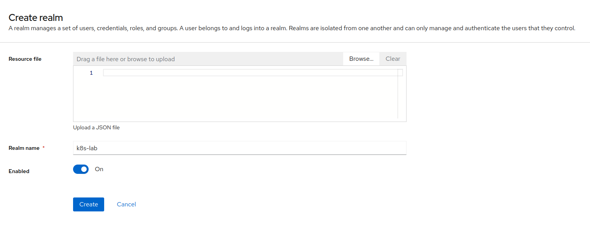
* Create 'groups' client scope as a default scope
  * Create new scope
  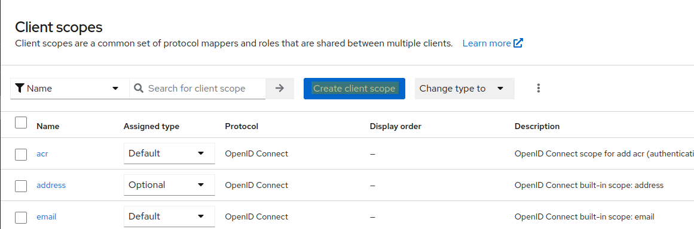
  * Name it as 'groups' and set it to 'Default' to assign it to any new clients automatically
  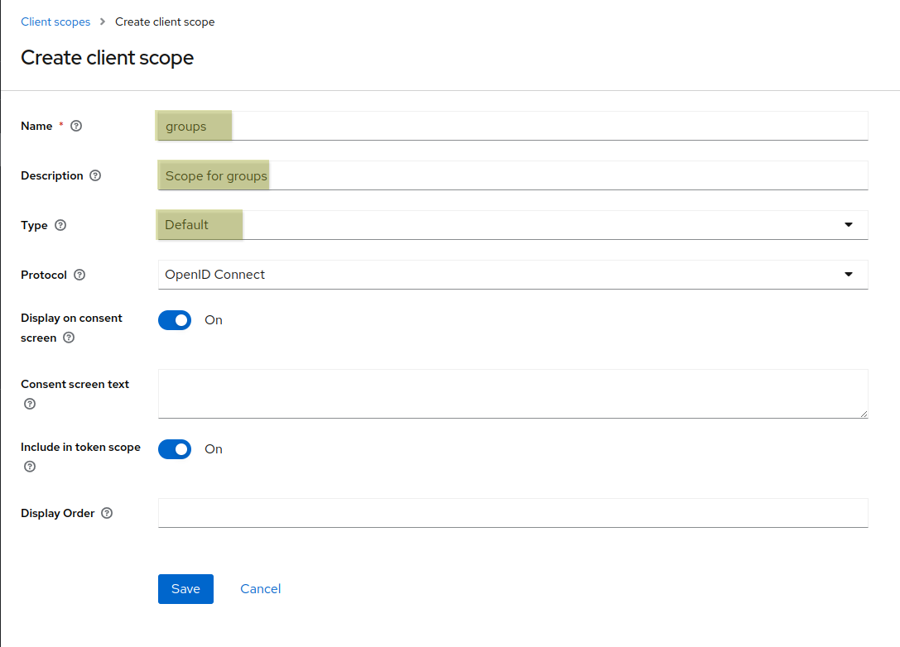
  * After the scope has been created create the mapper for it
  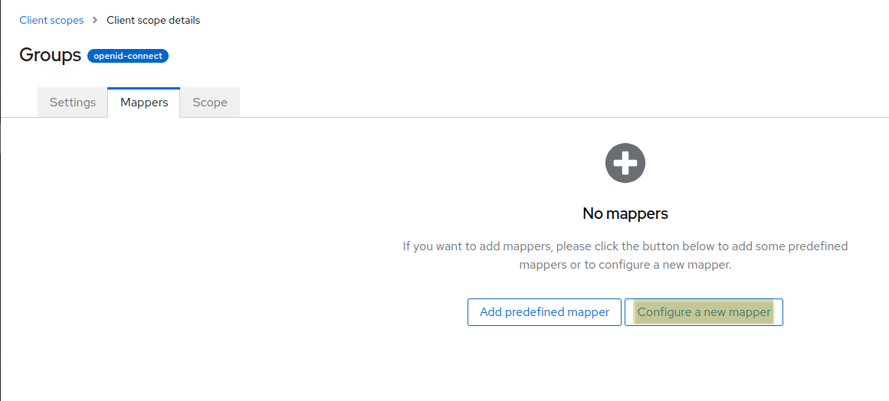
  * Choose 'Group membership'
  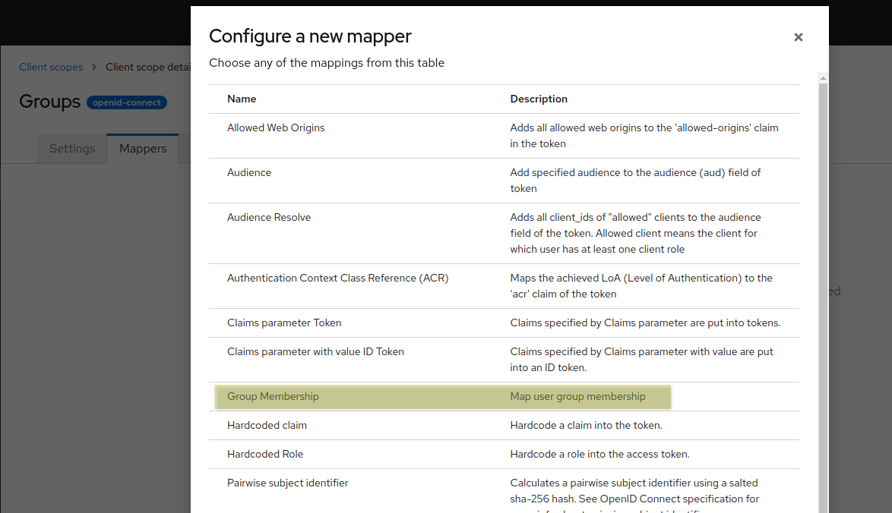
  * Set up the mapper
  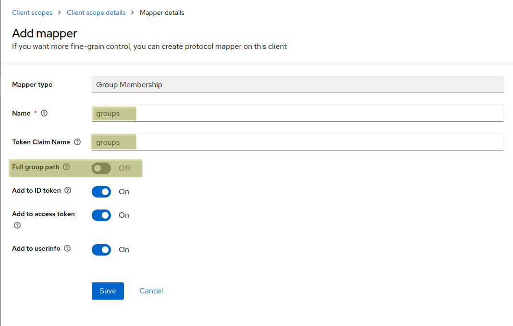
* Create ArgoCD client for OIDC
  * Create ArgoCD client
  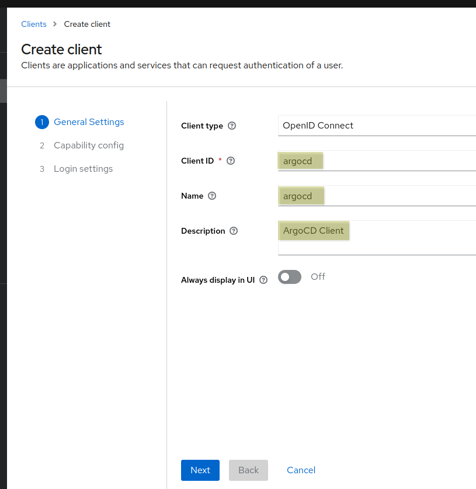
  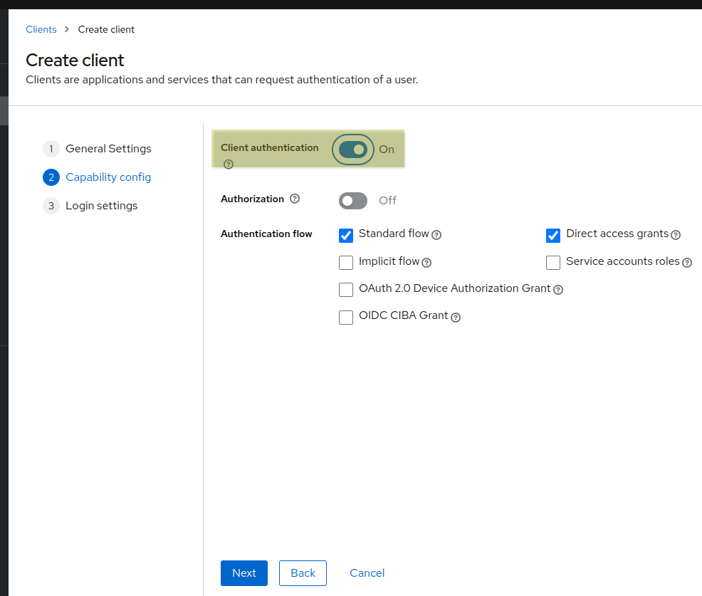
  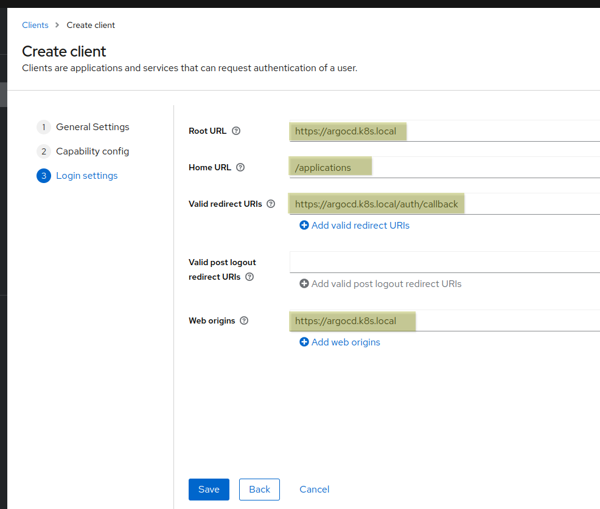
  * Note the client secret on the Client->Credentials tab in 'Client secret' blade. You must use it in ArgoCD helm manifest
  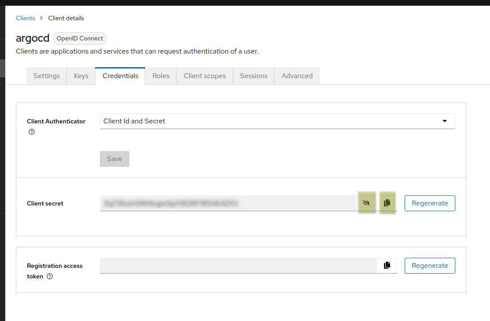
* Create an 'admin'group
  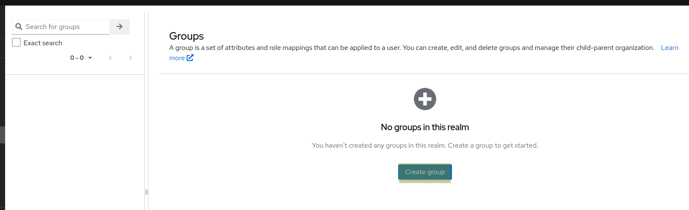
  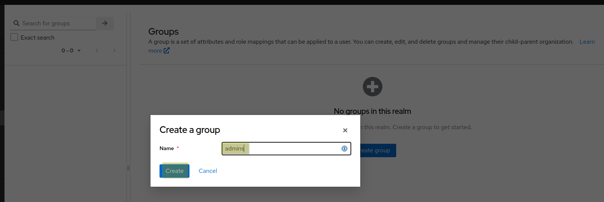
* Create a user in the realm as a member of the admin group
  * Don't set up required action
  * set the email verified
  * Join the user to the admin group
  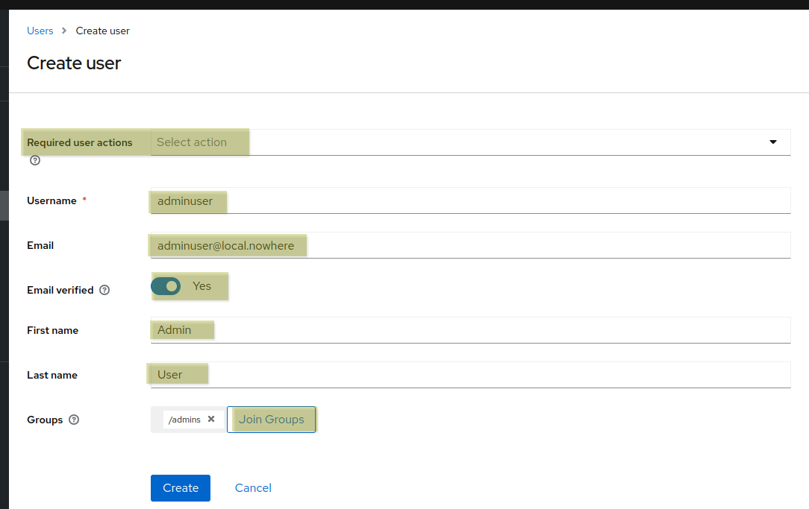
  * After it has been created set up the password under Credentials tab
  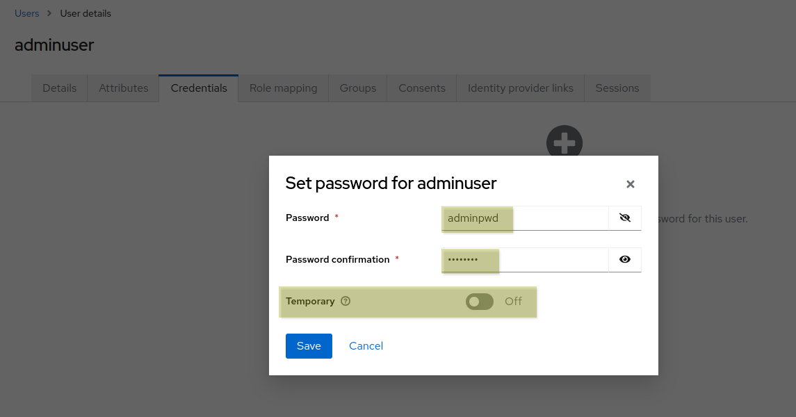

# Install ArgoCD

You must update the ArgoCD values with ( [argocd-values.yaml](../../argocd/argocd-values.yaml) )
* The client secret that is generated to your client
* The CA certificate pem content if you created a new CA cert for cert manager 
  * Since the traffic must be secured between ArgoCD and Keycloak ArgoCD must trust Keycloak certificate. To make it right we need to add the CA cert as trusted to ArgoCD

Additionally
* In the values for the rbac policy we map the "admins" group as ArgoCD administrators

```
$ helm repo add argo https://argoproj.github.io/argo-helm
$ helm install --create-namespace -n argocd argocd -f argocd/argocd-values.yaml argo/argo-cd
```

## Setup ArgoCD

After you set up everything you should be able to log in with the created adminuser with the password with clicking on the "Log in via Keycloak" button using URL: https://argocd.k8s.local

* First add your forked repo to ArgoCD globaly
  ```
  $ argocd repo add https://<your forked repo URI>/k8s-helm-training.git --username <your username> --password <your password>
  ``` 

* Create a project
  ```
  $ argocd proj create k8s-lab --description "All k8s-lab applications" -d https://kubernetes.default.svc,\*
  ```
  OR
  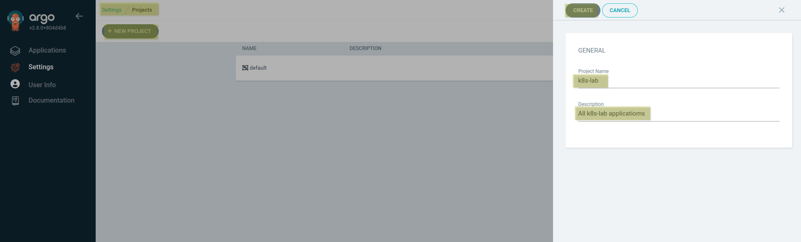
* In "Source Repositories" section click EDIT to add new repo
  ```
  $ argocd proj add-source k8s-lab https://gitlab.com/talentiaacademy/k8s-helm-training.git
  ```
  OR
  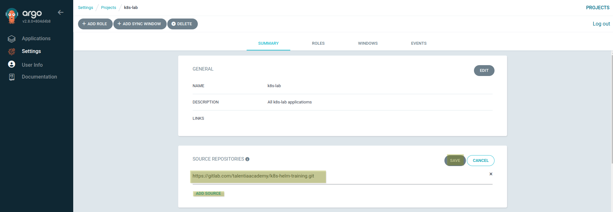
* In "Destination" section allow all namespaces to be used for deploying
  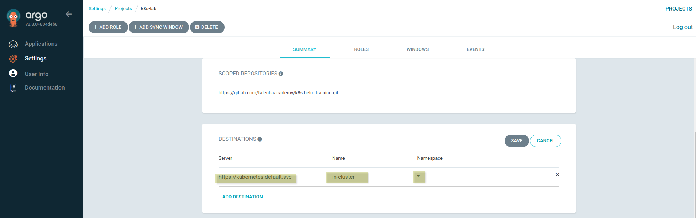
* In "Cluster resource allow list" section allow to create all kubernetes kinds on all API group (without this deployments will fail. This very open "allow" is good for our lab but in production you can consider more secure settings)
  ```
  $ argocd proj allow-cluster-resource k8s-lab "*" "*"
  ```
  OR
  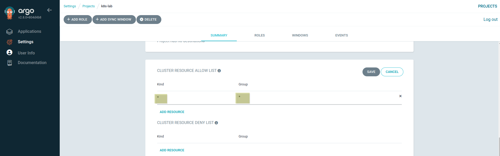

### ArgoCD CLI usage 

If you want to use argcd cli you must install it first then set it up. 
* For the installation just follow the documantation page
* To log in:
  * Get the builtin admin user password first
  ```
  $ kubectl get secret -n argocd argocd-initial-admin-secret -o jsonpath='{.data.password}' | base64 -d; echo
  ```
  * Login:
  ```
  $ argocd --insecure --username=admin login argocd.k8s.local
  # and provide the password
  ```

Happy argocding :D


> # ✋ Now you can continue with installing your first app on the cluster with ArgoCD [here](../basicservices/ReadMe.md)